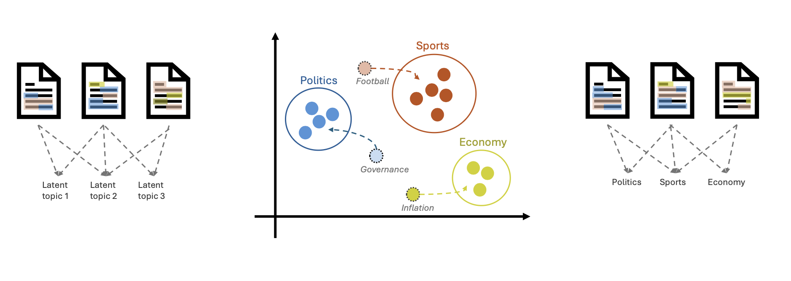

# Seeded Topic Modeling: A practical guide on how to guide topic models in Python with poisson-topicmodels

If you have ever used Latent Dirichlet Allocation (LDA) for topic modeling, you know the feeling of "topic roulette." You run the model, cross your fingers, and hope the resulting topics make sense. Often, you end up with a few "garbage" topics or, worse, the model misses the very specific concepts you were looking for.

What if you could guide the model? What if you could say, *"I know I have documents about 'Climate Change,' so look for topics related to these specific keywords"*?

This is exactly what **Seeded Topic Modeling** allows you to do. In this post, we’ll explore **Seeded Poisson Factorization (SPF)**, a modern alternative to LDA that is robust, handles sparse data beautifully, and allows for expert guidance through "seed" words.

---

## Why use Seed Words?

In many real-world scenarios, unsupervised models fail because they don't share your human context. Adding seed words is advantageous because:

1.  **Bridging the Gap:** You already know your domain. If you're analyzing medical records, you *know* "diabetes" and "insulin" belong together. Seeding ensures the model doesn't split these into separate, less meaningful clusters.
2.  **Stability:** Unsupervised models can change significantly with a different random seed. Seeding provides "anchors" that make your results more consistent and reliable.
3.  **Business Alignment:** If your stakeholders care about specific themes (e.g., "Customer Satisfaction" or "Security"), you can guarantee those themes appear in your results rather than hoping the model "finds" them.

---

## The SPF Idea

The core concept of Seeded Poisson Factorization is to combine the mathematical rigor of Poisson distributions with your own expertise.



*The model uses your keywords to "nudge" the discovery process, ensuring those words have a higher probability of appearing in their respective topics.*

---

## Why Poisson Factorization?

Traditional topic models like LDA rely on the Dirichlet distribution. While LDA is the industry standard, it often struggles with short texts or very sparse datasets.

**Poisson Factorization (PF)** is built on the Poisson distribution, making it naturally suited for count data and sparse matrices. It can scale better and often provides more "distinct" topics in noisy datasets. **SPF** takes this foundation and adds your expert guidance.


---

## Hands-on with `poisson-topicmodels`

The `poisson-topicmodels` library is built on **NumPyro** and **JAX**, allowing for lightning-fast execution on CPUs and GPUs.

### 1. Installation

```bash
pip install poisson-topicmodels
```

### 2. Preparing Your Data

```python
import numpy as np
from scipy import sparse
from poisson_topicmodels import SPF

# Prepare your Document-Term Matrix (counts) and vocabulary (vocab)
# counts = your_sparse_dtm
# vocab = np.array(['word1', 'word2', ...])
```

### 3. Defining Your Seeds

Define a dictionary where keys are your topics and values are the keywords.

```python
keywords = {
    "Technology": ["software", "digital", "algorithm", "innovation"],
    "Environment": ["climate", "sustainability", "carbon", "renewable"],
}
```

### 4. Training the Model

When training, we use Stochastic Variational Inference (SVI). Here is what the parameters mean:

*   **batch_size**: The number of documents processed in each training step. Smaller batches are faster but noisier; larger batches are more stable.
*   **num_steps**: How many iterations the model runs. More steps usually mean better convergence.
*   **lr (Learning Rate)**: Controls how much the model updates its "knowledge" in each step. Too high might skip the optimum; too low will take forever.

```python
model = SPF(
    counts=counts,
    vocab=vocab,
    keywords=keywords,
    residual_topics=5, # Discover 5 extra "surprise" topics
    batch_size=128
)

# Train the model
params = model.train_step(num_steps=500, lr=0.01)
```

### 5. Inspecting Results & Document Analysis

Once trained, you can easily analyze both the topics and how they relate to your documents.

#### Analyzing Document Topic Vectors
The `return_topics()` method is incredibly useful. It provides the primary topic for each document and the full distribution (theta) across all topics.

```python
# Get dominant topics and the document-topic matrix (theta)
doc_topics, theta = model.return_topics()

# Example: See the topic distribution for the first document
print(f"Document 0 dominant topic: {doc_topics[0]}")
print(f"Full topic vector: {theta[0]}")
```

#### Analyzing Topic Word Vectors
The `return_top_words_per_topic()` method provides you with the most dominant words per topic. This is especially useful, if you want to check how good the topic is caputured, or how are your seed words reflected within the most relevant words per topic. It can also be useful to analyze the content of the residual topics.

```python
# Get dominant words for each topic (beta)
top_words = model.return_top_words_per_topic(n=10)
```


#### Visualizing with Word Clouds
A great way to present your results is through Word Clouds. Since the model returns word weights for each topic, you can easily pass these to the `wordcloud` library to create beautiful visualizations.

```python
# Get top words for plotting
top_words = model.return_top_words_per_topic(n=20)
# You can now iterate through top_words and generate word clouds!
```

---

## Why Use SPF Over Guided LDA?

1.  **Sparsity Handling**: Better at handling the "long tail" of rare words.
2.  **Speed**: JAX-powered acceleration.
3.  **Flexibility**: Perfect mix of "guided" and "free" discovery.
4.  **Scientific Grounding**: A rigorous probabilistic model.

## Conclusion

By using Seeded Poisson Factorization, you can bridge the gap between automated data science and human expertise. `poisson-topicmodels` gives you the control you need to produce interpretable, actionable results.

**Ready to try it out?**
*   **Documentation**: [poisson-topicmodels.readthedocs.io](https://poisson-topicmodels.readthedocs.io/en/latest/)
*   **Paper**: [Seeded Poisson Factorization (ScienceDirect)](https://www.sciencedirect.com/science/article/pii/S095070512501161X)
*   **GitHub**: [Find the source code and examples here](https://github.com/BPro2410/poisson_topicmodels)

*Happy Modeling!*
