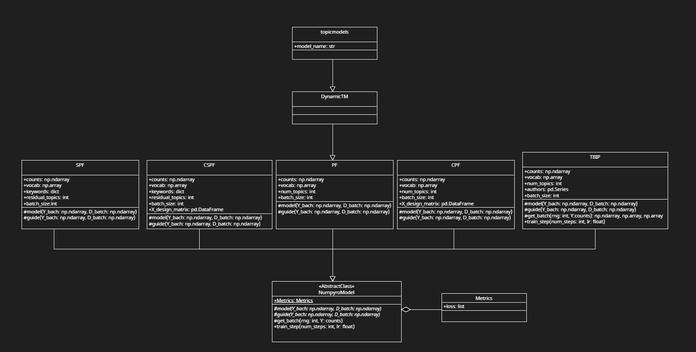

# topicmodels_package

Wie besprochen, unser Repository für das Package, welches verschiedene Poisson factorization Modelle in einem JAX Package ausführen kann.

Eine ANWENDUNGSFILE ist die [run_topicmodels](run_topicmodels.py) file!

Gerade implementiert sind:
- SPF
- SPF mit Covariates (CSPF)
- Standard PF
- PF mit Covariates (CPF)
- TBIP

Die Architektur sieht aktuell so aus (UML Klassendiagramm):


Ich habe das Package mal 'topicmodels' genannt, in Analogie zu Bettinas R package :). Der API Call würde erfolgen mit z.B.:

```python
tm = topicmodels("SPF", ...)
```

Basierend auf dem ersten Argument, spezifiziert der Anwender, welches Poisson Modell er erhalten möchte. Alle Modelle erben ihr Interface von einer Abstrakten Klasse, getauft NumpyroModel, welche definiert, dass jedes implementierte Modell einen Guide (variational family) und ein Modell (data generating process) für sich selbst definieren muss. Inferenz und Batching sind für alle Modelle gleich, sofern nicht spezielle Verfahren benötigt werden (wie z.B. bei TBIP, das ja noch den ideal point hat und somit author indices im batching benötigt).

Das funktioniert so eigentlich aktuell ganz gut und ist auch sauber 'aufgeräumt' wie ich finde.

Offene To Do's u.a.:
- Welche Modelle möchten wir noch drin haben?
- Welche Attribute sind in den Modellen immer gleich? Wir können noch mehr Attribute als 'Standard' in die Abstrakte Klasse geben, sobald wir den ganzen Modellumfang wissen. Wie z.B. counts, vocabulary und batch_size. Das kommt stand jetzt bei jedem Modell vor.
- Welche Outputs soll der User bekommen? Was möchte der Anwender returnt haben?


Als Packages nutzen wir recht wenig:
- JAX und numpy für computation
- Numpyro für die graphical models
- Optax für den Optimierer (Adam)
- pandas und scikit-learn für die Daten und die DTM Erstellung

